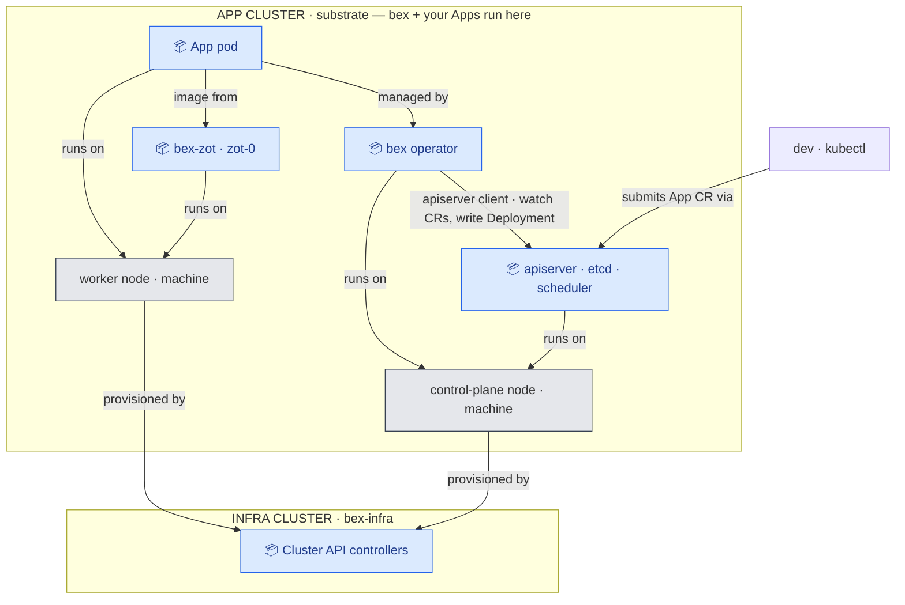

# bex — deploy-from-git on an elastic, multi-machine substrate

bex is the **deploy-from-git half** of bex.co (strategy 211.09): a Git repo (or a prebuilt image) becomes a running service, scheduled across machines that are **added/removed elastically** — and the whole thing runs **locally as a mock** that swaps to **Hetzner** by changing one provider overlay.

Today's brain is a **Go Kubernetes operator** that reconciles `App` CRs into running services. The planned next layer is a **Postgres-backed control plane** — the product's **source of truth** (tenants / apps / domains + business logic) that projects rows into `App` CRs; the operator stays a thin executor. See [`docs/control-plane.md`](docs/control-plane.md). Everything else is assembled open source. Full design in [`docs/architecture.md`](docs/architecture.md).

## Panorama



**Every arrow is a dependency: `A → B` means _A depends on B_** (it points to what A needs). **Blue 📦 = Pod · gray = machine (k8s node).**

- An **App pod** depends on the **operator** (which manages it), **`bex-zot`** (pulls its image), and the **worker node** (runs on it).
- The **operator** depends on the **apiserver** — it's a **client** of it: it watches `App` CRs and writes Deployments; it **never talks to pods directly**. (Plus the node it runs on.)
- Both **machines** depend on **Cluster API** — it provisions them.

Note the direction: "operator _creates_ pod" becomes **`pod → operator`**, and "CAPI _provisions_ machine" becomes **`machine → CAPI`** — in a dependency graph the created/managed thing points at what it depends on, i.e. the arrow is the reverse of the "who-makes-what" flow. Outer boxes = the two **clusters**; a _machine_ is a server (Hetzner) or Docker container (local). Swap `CAPD`→`CAPH` and the picture is identical. (For a request/response view of a deploy, see the request-flow diagram in [`docs/control-plane.md`](docs/control-plane.md).)

> **"control plane" is overloaded — three distinct things.** (1) The **BEX OPERATOR** (`· bex`) — a pod that _executes_ deploys (reconciles `App` CRs → Deployment/Service/ Ingress); a **client** of the apiserver, runs in-cluster, never on your laptop. (2) The **control-plane node** (apiserver/etcd/scheduler) — the _cluster's_ own master. (3) The **bex control plane** _(planned)_ — a Postgres-backed service that _decides_ intent (tenants/apps/domains + business logic) and writes the `App` CRs the operator executes; see [`docs/control-plane.md`](docs/control-plane.md). Today there is no (3): you `kubectl apply` App CRs directly.

- **Two clusters.** The **app cluster** runs the bex operator **and** your Apps; the **infra cluster** runs only Cluster API (it provisions the app cluster's machines). `BEX OPERATOR`, Cluster API and `bex-zot` are **pods / containers** — no extra machines. On Hetzner the machines are the cluster **nodes**; swap `CAPD`→`CAPH` and the picture is identical. (_infra cluster_ / _app cluster_ are bex's names for Cluster API's _management_ / _workload_ cluster; a 3rd legacy `orbstack` cluster still hosts the OpenSandbox `hello-go` demo.)
- **machines = nodes** of the app cluster — Docker containers under CAPD locally, Hetzner servers under CAPH. **Add/remove a machine** = scale the worker pool; the operator bin-packs pods onto the nodes.

## Two layers

- **`bex`** (Go): build → deploy → serve, placement, the auto-allocator. Two parts: the **operator** (today — reconciles `App` CRs → Deployments; node-aware, **provision-unaware**, only reads `Node`/`Pod`) and, **planned**, the **control plane** — a Postgres source of truth (tenants/apps/domains + business logic) that writes the `App` CRs the operator executes ([`docs/control-plane.md`](docs/control-plane.md)).
- **`bex-infra`** (`infra/`): how clusters and machines _exist_ — Cluster API + a provider (CAPD locally, CAPH on Hetzner), Cluster Autoscaler, Terraform.

`infra/` makes the cluster (day-0, from outside); `deploy/` is what Argo reconciles _into_ it (day-1+). bex never references `infra/`.

## Runtimes (`BEX_RUNTIME`)

|  | runs a revision as | use |
| --- | --- | --- |
| `kubernetes` | a **Deployment** (pods on cluster machines) | the elastic, multi-machine path (CAPD/Hetzner) |
| `opensandbox` | an OpenSandbox sandbox (host Docker) | real `pause`/`resume` snapshots; single host |

## The `App` resource

```yaml
apiVersion: app.bex.co/v1alpha1
kind: App
metadata: { name: whoami }
spec:
  image: traefik/whoami # prebuilt image; OR build from git with `repo:` + `branch:`
  port: 80
  replicas: 2 # pods bin-pack across machines
```

`kubectl get apps.app.bex.co` shows phase / revision / url.

## Quickstart: local CAPD mock (machines = Docker containers)

Prereqs: Docker (OrbStack), Go ≥ 1.22, `kubectl`, `kind`, `clusterctl`.

```bash
# 1. stand up the mock Hetzner substrate: kind infra cluster + Cluster API + CAPD
#    + an app cluster whose nodes are Docker containers (+ Calico CNI).
bash scripts/mock-cluster.sh            # writes infra/local/bex.kubeconfig
export KUBECONFIG=$PWD/infra/local/bex.kubeconfig

# 2. deploy bex AS A POD in the app cluster (kubernetes runtime). Build the operator
#    image, load it into every node's containerd (CAPD can't pull a local-only image), deploy.
( cd operator && make docker-build IMG=bex-operator:dev )
docker save bex-operator:dev -o /tmp/bex-op.tar
for n in $(kubectl get nodes -o name | sed 's|node/||'); do
  docker cp /tmp/bex-op.tar "$n":/op.tar && docker exec "$n" ctr -n k8s.io images import /op.tar
done
( cd operator && make deploy IMG=bex-operator:dev )   # ns bex-system, BEX_RUNTIME=kubernetes
# local CAPD only: pin the operator to the control-plane node — OrbStack/Calico can't route
# cross-node pod→apiserver (the same gap crashes calico-kube-controllers). Real CNI needs no pin.
kubectl -n bex-system patch deploy bex-controller-manager --type merge -p \
 '{"spec":{"template":{"spec":{"nodeSelector":{"node-role.kubernetes.io/control-plane":""},
  "tolerations":[{"key":"node-role.kubernetes.io/control-plane","effect":"NoSchedule"}]}}}}'
kubectl -n bex-system rollout status deploy/bex-controller-manager   # operator pod ready

# 3. deploy an App — the in-cluster operator reconciles it; pods land on the worker machines
kubectl apply -f examples/whoami-app.yaml
kubectl get pods -l app.bex.co/app=whoami -o wide   # see them on bex-worker-0-* nodes

# 4. ★ add a machine, then scale the App onto it
bash scripts/mock-cluster.sh scale 2    # worker pool 1 -> 2 (a new container node joins)
kubectl patch apps.app.bex.co whoami --type merge -p '{"spec":{"replicas":6}}'
kubectl get pods -l app.bex.co/app=whoami -o wide   # pods now spread across both machines

# fast dev loop (optional): run the operator from source instead of as a pod —
# ( cd operator && make install && BEX_RUNTIME=kubernetes make run )
```

## Deploy to Hetzner (same bex, different provider)

Only the infrastructure overlay changes — `infra/clusterapi/overlays/local-capd` → `…/hetzner-caph` (a real CAPH manifest is committed there). The bex control plane and the `App`/Deployment are byte-for-byte identical. See [`infra/README.md`](infra/README.md) and the overlay README.

## Layout

```
operator/   Go operator (kubebuilder)
  api/v1alpha1/   App CRD          internal/build/    build plane (CNB/Dockerfile → Zot)
  cmd/            manager entrypoint   internal/runtime/   OpenSandbox client
  config/         CRD/RBAC kustomize   internal/controller/ reconcile: kubernetes + opensandbox runtimes
infra/           bex-infra: terraform/ · clusterapi/{base,overlays/{local-capd,hetzner-caph}} · local/
deploy/          gitops/{bootstrap,base,overlays/{local,staging,prod},charts} · opensandbox/ server configs
examples/        whoami-app.yaml (prebuilt), hello-go/ (build-from-git sample)
docs/            architecture.md · go-and-gitops.md
scripts/         mock-cluster.sh · up.sh · deploy-sample.sh · start-opensandbox*.sh
```

## Status

Working & verified: the **Go control plane** (App CRD + reconcile, finalizer teardown); the **kubernetes runtime** (App → Deployment → pods on machines); the **local CAPD mock** with **add/remove machine** and pods bin-packing onto added machines; the **opensandbox runtime** (build CNB/Dockerfile → Zot → sandbox, real pause/resume); the **Hetzner CAPH overlay** (manifest committed, not applied — no account).

Tracked next: the **bex control plane** — a Postgres **source of truth** (tenants / apps / domains + business logic) that projects to `App` CRs, so business data is durable and queryable instead of living only in the app cluster's **etcd** (lost on a node _rebuild_; Apps are imperative, not in git) — see [`docs/control-plane.md`](docs/control-plane.md); the **wake activator** + **HMAC webhook** (not yet ported); **Cluster Autoscaler** wiring so add/remove-machine is reactive (not manual); in-cluster builds (BuildKit/kpack Job) so build-from-git images are pullable by cluster nodes. The **edge (HTTPS via `App.spec.host`)** is live — Traefik + cert-manager. See [`docs/architecture.md`](docs/architecture.md).
