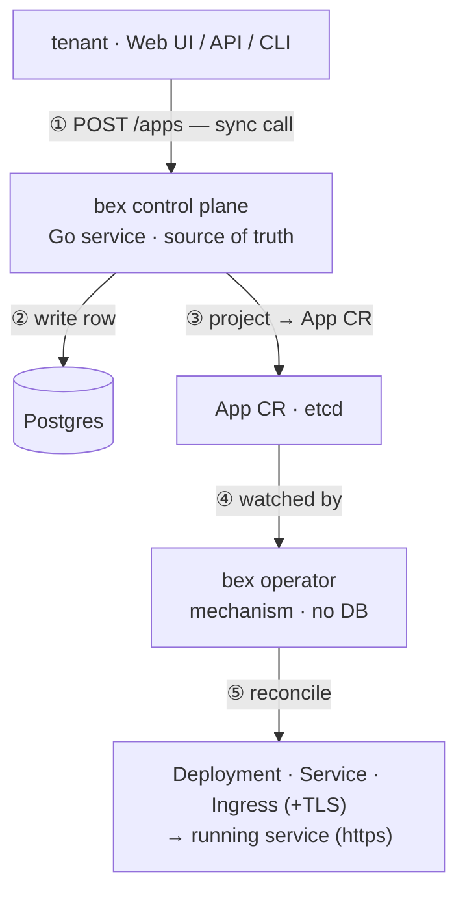

# bex control plane (source of truth) vs. operator (mechanism)

> **Status: planned direction, not built yet.** Today there is **no control plane and no Postgres** — you `kubectl apply` an `App` CR, the **operator** reconciles it, and the only store is the app cluster's **etcd**. This doc describes where bex is going and why, so the boundary is clear before the code exists.

bex's Go layer splits into **two collaborating components** — keep them distinct:

|  | **bex control plane** (planned) | **bex operator** (exists) |
| --- | --- | --- |
| role | **policy / intent** — business logic + the source of truth | **mechanism** — make reality match intent |
| owns | tenants, apps, domains, plans/billing, quotas, auth | `App` CR → `Deployment` + `Service` + `Ingress` (+TLS) |
| store | **Postgres** (durable, queryable, backed up) | **none** — it's a k8s controller; its "store" is the API/etcd |
| interface | an API / web UI for users | watches `App` CRs; writes their `status` |
| decides | _what should exist & who's allowed_ | _how to run it_ (rollout, health-gate, idle-hibernate) |
| code | a Go service (`operator/` repo, separate binary) | `operator/internal/controller` (kubebuilder) |

**Rule of thumb:** business/product logic lives in the **control plane**; the operator stays a thin, idempotent, **CR-driven** reconciler with **no DB** and no policy.

## Request flow: a tenant hosts a new service

Users call the **control plane**, never the operator — the operator has no user-facing API; it's an internal k8s controller at the **tail** of the pipeline.



What the pipeline gets right — and the mistakes to avoid:

- **Users never call the operator; the control plane is the front door.** Don't route `tenant → operator` (it has no API) or `operator → control plane` (the operator is _downstream_ of CRs, not upstream). The operator is always at the tail.
- **Only the first hop is a synchronous "call".** `tenant → control plane` is request/response (returns once the row is written). Everything after — `control plane → App CR → operator → runtime` — is **declarative and eventually consistent**: the control plane writes _desired state_ (a CR), the operator _reconciles_ it asynchronously (level-triggered, not RPC). The App's `status.url` appears once reconcile finishes.
- **The `App` CR is the contract.** The control plane writes intent; the operator executes it. Either side can be built/tested against that contract independently.

## Why a Postgres source of truth (the durability + product case)

- **Durability.** Business data (who owns which app/domain) belongs in a real DB, backed up off-node. Today everything lives only in the single app node's **etcd** (`/var/lib/etcd`, local disk, no HA) — a node _reboot_ is fine, but a node _rebuild_ loses it, and the App is **not in git** (Apps are imperative by design). With Postgres as the truth, **etcd becomes a rebuildable projection**: lose the cluster, re-`project` from Postgres.
- **Multi-tenant / BYOD.** Tenants, custom domains, plans, quotas are **relational business data** with queries/joins/an API — not a fit for etcd (size-capped ~8 GB, no queries, no watch-as-a-database). A domain a tenant adds becomes a row → the control plane projects an `App`/Ingress → the operator + cert-manager issue TLS (Traefik routes new hosts with no reload — see [`docs/architecture.md`](architecture.md)).
- **API/UI.** Users interact with rows through a product API, not `kubectl`.

## Multi-tenancy: isolation units ≠ worker pools

A tenant maps to an **isolation unit** (namespace / vcluster / sandbox), **not** to a worker pool — the two are orthogonal. A **worker pool** (`worker-0`, `worker-1`, …) is a group of identical **machines** that exists for _infrastructure_ reasons (CPU vs GPU vs ARM, region, spot vs on-demand); there are few of them and **all tenants share them**. A **tenant** is _who_ + isolation/billing, and there can be thousands.

So **one pool per tenant is wrong**: each pool needs ≥1 machine, so it would mean ≥1 dedicated machine per tenant — cost blows up and it defeats bex's whole model (bin-pack many tenants' pods onto shared nodes, idle-evict, autoscale machines by _aggregate_ demand). `worker-1`/`worker-2` are added by machine _shape_, never per tenant.

How a tenant is actually isolated (weak → strong; **all share the same worker pools**):

| unit | strength | machines | use |
| --- | --- | --- | --- |
| **namespace / tenant** | soft (shared kernel) + RBAC/Quota/NetworkPolicy | shared | default; cheapest, densest |
| **vcluster / tenant** | stronger API isolation (own apiserver view) | shared | the planned per-tenant vcluster |
| **sandbox/microVM / workload** (OpenSandbox·Kata·Firecracker) | hard (own kernel) | **still shared** | bex's `sleep=free` runtime |
| **dedicated nodes/pool / tenant** | physical | **dedicated** | **exception**: paid/compliance only |

Only the last row ties a tenant to dedicated machines — and even then it's "pin tenant X's pods to a dedicated pool" via node **taints** + pod **nodeSelector/affinity**, a premium opt-in, not `worker-N = tenant N`.

**In the control plane:** a tenant row → an isolation unit (namespace/vcluster/sandbox); its Apps deploy there and **bin-pack onto the shared worker pools**. An App that needs special hardware (GPU) lands on the matching pool via a _scheduling constraint_, not because the pool belongs to it.

## Tiers (plans) → pod resources → machine provisioning

A **tier/plan** (Free, Starter, Standard, Pro, …) is just a fixed **resource allocation** per pod — RAM + CPU, nothing more. The operator expresses it as the pod's `requests` = `limits` (that's k8s's only knob for "give this pod exactly X"); same mechanism for every tier, only the numbers differ.

| tier (Render-style) | RAM    | CPU | pod `requests`=`limits` |
| ------------------- | ------ | --- | ----------------------- |
| Free                | 512 MB | 0.1 | `512Mi` / `100m`        |
| Starter             | 512 MB | 0.5 | `512Mi` / `500m`        |
| Standard            | 2 GB   | 1   | `2Gi` / `1`             |
| Pro                 | 4 GB   | 2   | `4Gi` / `2`             |
| Pro Plus            | 8 GB   | 4   | `8Gi` / `4`             |
| Pro Max             | 16 GB  | 4   | `16Gi` / `4`            |
| Pro Ultra           | 32 GB  | 8   | `32Gi` / `8`            |

**Provisioning = bin-pack the sum, autoscale by the sum.** Pods of all tiers **bin-pack onto the shared worker pools** (scheduler `MostAllocated`, for density). The machine capacity you must run ≈ **Σ(running pods' tiers)**; as that sum grows the autoscaler/CAPI **adds a machine**, as it shrinks (after idle-evict) it **removes** one. There are **no per-tier pools** — a tier only sets how big the pod is.

**Node size is bounded by the largest tier offered.** A `Pro Ultra` pod (32 GB/8 CPU) needs a node ≥ that — so either the pool uses big enough machines (on Hetzner a `ccx`/`cpx` with ≥32 GB) or the offered tiers are capped to what the node catalog holds.

**Free tier = sleep-when-idle (decided).** Idle free apps **hibernate** (`sleep = free`) and **wake on the next request** via the gateway **activator** (Knative-style); a sleeping pod occupies nothing, so the cluster **overcommits well beyond Σ** and Free approaches \$0. So the `Σ(running pods)` above is really `Σ(paid pods + currently-awake free pods)` — sleeping free apps don't count. **Paid tiers stay reserved** (always-on, `request=limit`). The price of this choice: a **cold-start** on wake (hold/queue the first request while the pod resumes) and an **idle-detector + activator in the request path**. This is the same `sleep = free` loop bex already runs for the OpenSandbox runtime (idle → pause, request → resume) — see [`architecture.md`](architecture.md).

**Where it lives in bex:** `App.tier` (set from the plan in Postgres) → the operator translates it to the pod's `requests/limits`; the **auto-allocator** bin-packs + idle-evicts; CAPI / Cluster Autoscaler turns the aggregate into machines. _(Planned: the `tier` field on `App` and the autoscaler wiring — today pod resources are implicit and machine count is manual.)_

## One Postgres, owned by the control plane

- **One instance**, not two — two Postgres for one product is wasted ops at this scale.
- **Only the control plane connects to it.** The operator does **not** share it (it has no DB). If the operator ever needs its own state, isolate at the logical level — separate **database/schema + role** in the same instance — not a second server.
- **Don't** put business logic in the operator (keep it mechanical) **or** in Postgres itself (triggers/stored procedures) — logic lives in the control plane's Go code; Postgres is storage.
- **Don't** have the operator read Postgres directly instead of CRs — that throws away k8s watch/RBAC/GC and forces you to rebuild change-notification.

## Schema sketch (illustrative)

```sql
tenants (id, name, plan, created_at, …)
apps    (id, tenant_id→tenants, name, repo|image, port, replicas, idle_ttl, …)
domains (id, app_id→apps, host, verified_at, cert_status, …)   -- BYOD custom domains
-- + accounts/auth, usage/billing, audit
```

The control plane reconciles these rows into `App` CRs (e.g. an `apps` row + its primary `domains` row → an `App` with `spec.host`); the operator does the rest.

## What's built vs. planned

- **Built:** the `App` CRD + operator (reconcile → Deployment/Service/Ingress/TLS), GitOps platform (Traefik, cert-manager, Zot, Argo), the local CAPD mock → Hetzner CAPH.
- **Planned (this doc):** the Postgres-backed control plane (service + schema + projection to CRs), tenant/domain/billing logic, the product API/UI. Until then: `kubectl apply` App CRs directly; etcd is the store; snapshot etcd off-node for interim durability.
